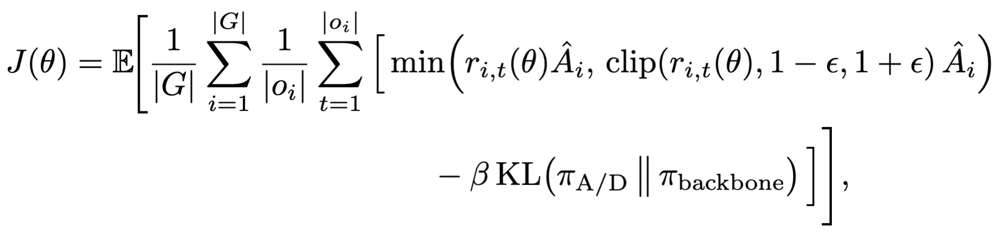

# Mosaic Attacks

<div align="left" style="line-height: 1;">
  <a href="https://arxiv.org/pdf/XXX.XXX" target="_blank">
    
  </a>
  <a href="https://huggingface.co/EmanueleLaMalfa/MosaicAttacks" target="_blank"></a>
</div>

This repository contains the instructions to replicate the experiments of the paper "Reflections and Fragments: Securing LLMs Against Sequential Mosaic Attacks", as well as the results of our evaluation.

Mosaic attacks split a malicious prompt into a sequence of sub-prompts. Each sub-prompt is benign on its own; together they recover the original harmful intent.

It also points to the LoRA checkpoints of the Qwen3.6-35B-A3B, Gemma4-26B-A4B, and DeepSeek-V2-Lite models used in our experimental evaluation.

The repository is structured as follow:

```
results-paper/     evaluation results reported in the paper
training/          configs and seed data for attacker/defender self-play training (GRPO)
mosaic-no-train/   mosaic attacks without training (prompt-based decomposition)
```

### Results of the Paper

- `Wildmosaic/`, `Advbench/`: AdvBench evaluations of trained checkpoints; `Wildjailbreak/`: the same on WildJailbreak. One folder per training run. For each checkpoint, `stat-significance/checkpoint-<N>/` holds four arms:
  - `base`: base attacker vs. base defender (control);
  - `attack-only`: trained attacker vs. base defender;
  - `defend-only`: base attacker vs. trained defender;
  - `ckpt`: trained attacker vs. trained defender.

  Each arm has `summary.csv` and `round-0/` (`transcripts.jsonl`, `judgements.jsonl`, `metrics.json`). `stat_significance.json` and `mosaic_significance.json` compare the arms against the control. 
- `results-advbench/WildMosaic/before-grpo/`: checkpoints trained on WildMosaic seeds, before GRPO.
- `runs/`: summary tables per model family (`qwen`, `gemma`) and benchmark, as `.md`, `.txt` and `.jsonl`.
- `topic_breakdown/`: assign each malicious prompt a harm topic and plot per-topic jailbreak rates, base vs. defender. Outputs are in `out/<family>/`.

### Mosaic Attacks -- Training

We train the attacker and defender with a GRPO-style policy-gradient procedure [Shao et al., 2024] adapted to multi-turn interaction. For each malicious seed, the models generate a group of $G$ complete conversations.
A judge assigns a terminal verdict and per-turn harmful-progress scores, from which we construct role-specific rewards. Using the standard clipped policy-ratio objective, the per-role loss is

<p align="center">
  
</p>

where $r_{i,t}(\theta)$ is the policy ratio, $\hat{A}_i$ is the advantage assigned to the corresponding generated segment, and $\beta$ controls anchoring to the frozen backbone. Our procedure differs from standard GRPO primarily in trajectory selection and in the construction of rewards and advantages.

We trained our models on a slurm cluser, feel free to send us an email if you need the python files to replicate the experiments.
We will soon upload a fully compatible bare-metal version of the code.

- `configs/config.yaml`: default training config (model, LoRA adapters, judge, reward, optimisation).
- `configs/preset/`: presets for the policy setup (`bipolicy_lora`, `shared_backbone`, `asymmetric`).
- `data/{advbench,wildjailbreak,wildmosaic}/`: `malicious_seeds.csv` and `benign_seeds.csv`, used as training seeds.
- `reward_shaping.json`: reward definitions (`vanilla`, `strict_nobhack_defneutral_dense_benguard_potential`).
- `run_config.json`: full resolved config of a training run.

### Mosaic Attacks -- No Training

We report some mosaic attacks generated by Qwen3.6-35B-A2B and evaluated by a strong judge, i.e., Qwen3.6-110B-A10B.

Only the re-writings that pass a strict control (i.e., 3 independent evaluations that check whether the attack is malicious but benign-in-isolation) are retained.

- `prompts/extract.md`: prompt that decomposes a malicious prompt into sub-prompts.
- `prompts/eval.md`: prompt that checks the sub-prompts preserve the original intent while each is benign in isolation.
- `prompts/judge.md`: prompt that judges whether a model's responses, taken together, are malicious.
- `results/wildjailbreak_equivalent_subprompts.json`: a sample of WildJailbreak prompts and their retained sub-prompt decompositions.
- `results/<model>/<timestamp>/`: `conversations.json` (target-model responses to the direct prompt and to the sub-prompts) and `eval.json` (judge verdicts and attack success rate, direct vs. sub-prompt).

## Cite our Paper
Please use this bibtex handle to cite our work:
```
@misc{lamalfa2026fragments,
      title={Reflections and Fragments: Securing LLMs Against Sequential Mosaic Attacks}, 
      author={Emanuele La Malfa and Saar Cohen and Gabriele La Malfa and Mickel Liu and Natasha Jaques and Michael Wooldridge},
      year={2026},
      eprint={XXX.XXX},
      archivePrefix={arXiv},
      primaryClass={cs.AI},
      url={https://arxiv.org/abs/XXX.XXX}, 
}
```